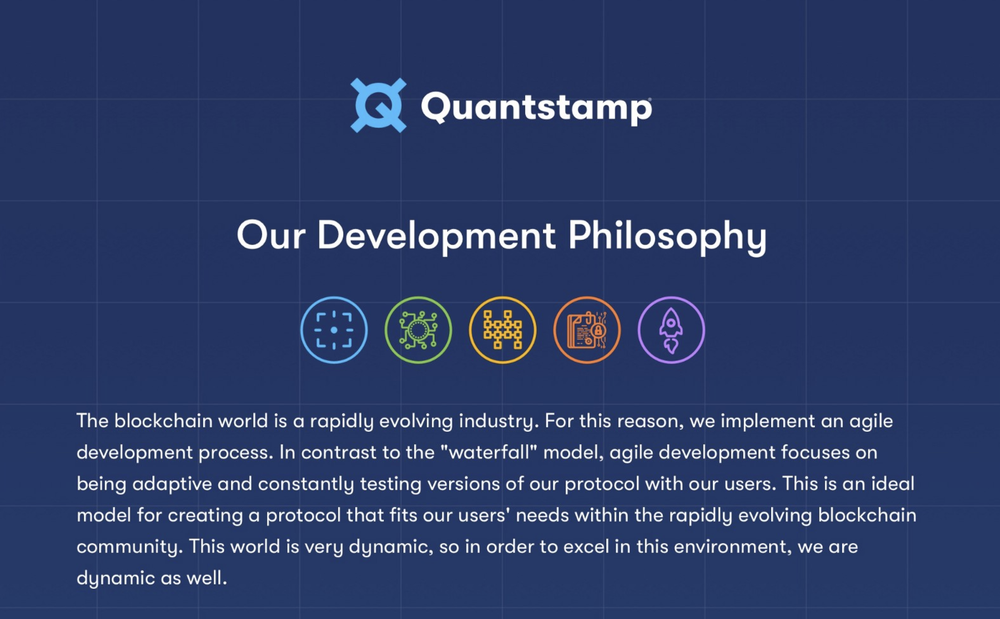
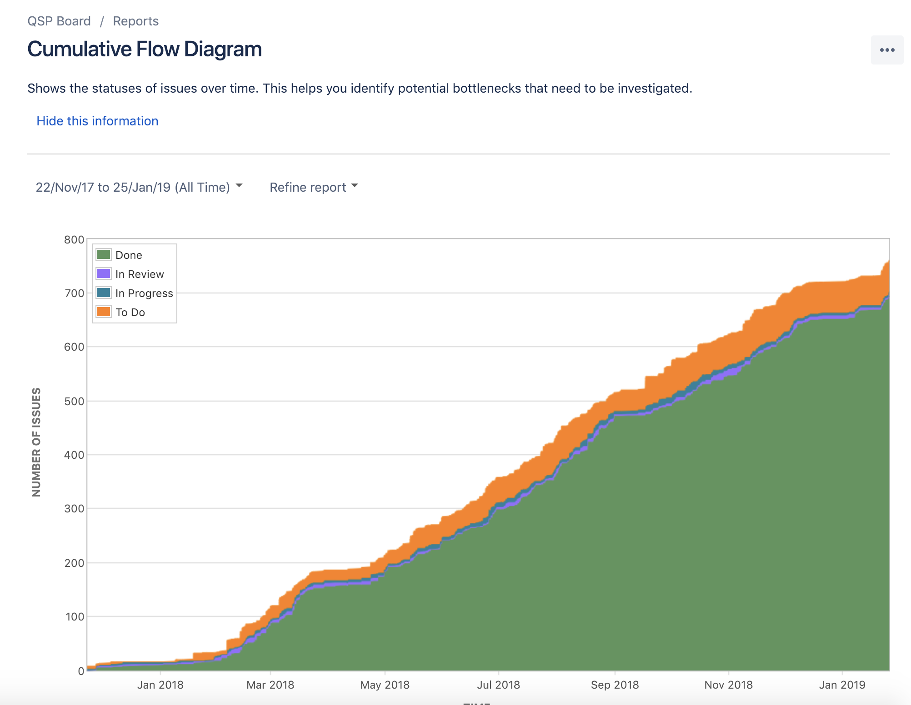
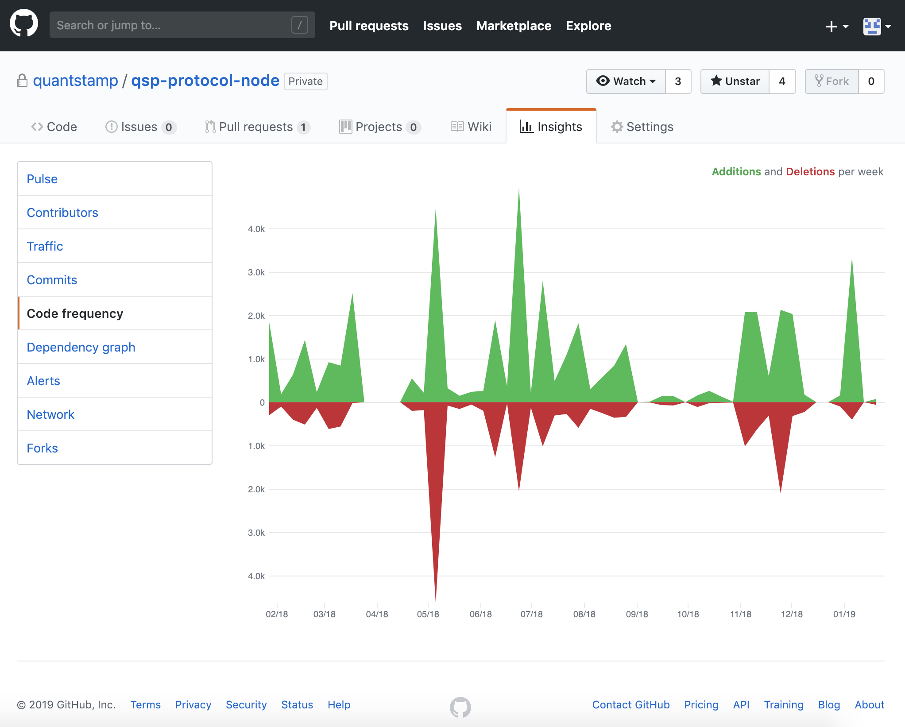
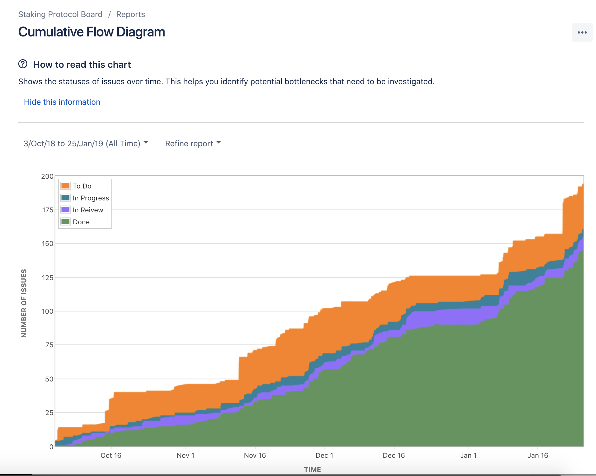

# Quantstamp Development Process

We are formal verification and security experts at heart. When we release code publically, we have ensure it has been thoroughly tested. We follow or exceed industry standard security practices, this extends to our development. This is a glimpse into our updated private repo activity on github and via our project management board JIRA.

# JIRA Board Cumulative Flow for Protocol Node

# Internal Github Code Frequency for Protocol Node

# JIRA Board Cumulative Flow for Staking Protocol

# Development Roadmap

[Updated Roadmap](https://medium.com/quantstamp/quantstamp-visual-timeline-q4-2018-b61c369fea26)

# About

[About](https://quantstamp.com/about)

# Get The Latest Updates

[Latest Updates Signup](http://bit.ly/QSPNews)

©2019 Quantstamp, Inc.  All rights reserved.
Disclaimer:  This content is provided for informational, personal, non-commercial purposes on an as-is, where-is, and as-available basis. This content may include descriptions or forward-looking statements concerning concepts under continuing development in testing environments, along with features, functionality, schedules, or design architectures, but all of the foregoing are subject to continuing update, modification, cancellation, delay, external dependencies, evolving regulatory frameworks, and/or factors beyond our control and you are cautioned not to place undue reliance on this information. FOR AVOIDANCE OF DOUBT, THIS CONTENT, INCLUDING ANY ASSOCIATED SERVICES OR MATERIALS, SHALL NOT BE CONSIDERED OR RELIED UPON AS ANY FORM OF FINANCIAL, INVESTMENT, TAX, LEGAL, REGULATORY, OR OTHER ADVICE.

